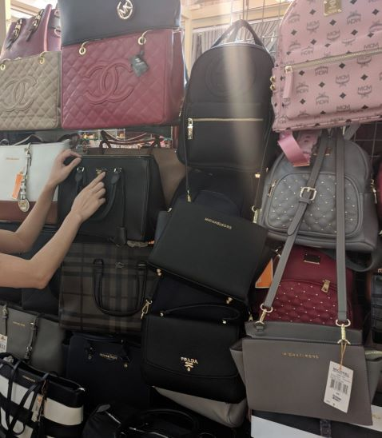
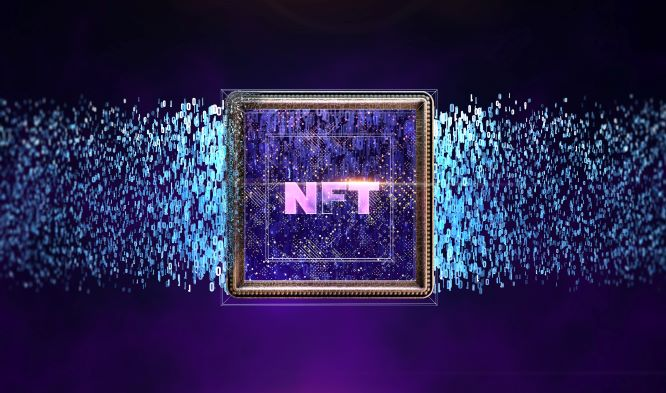
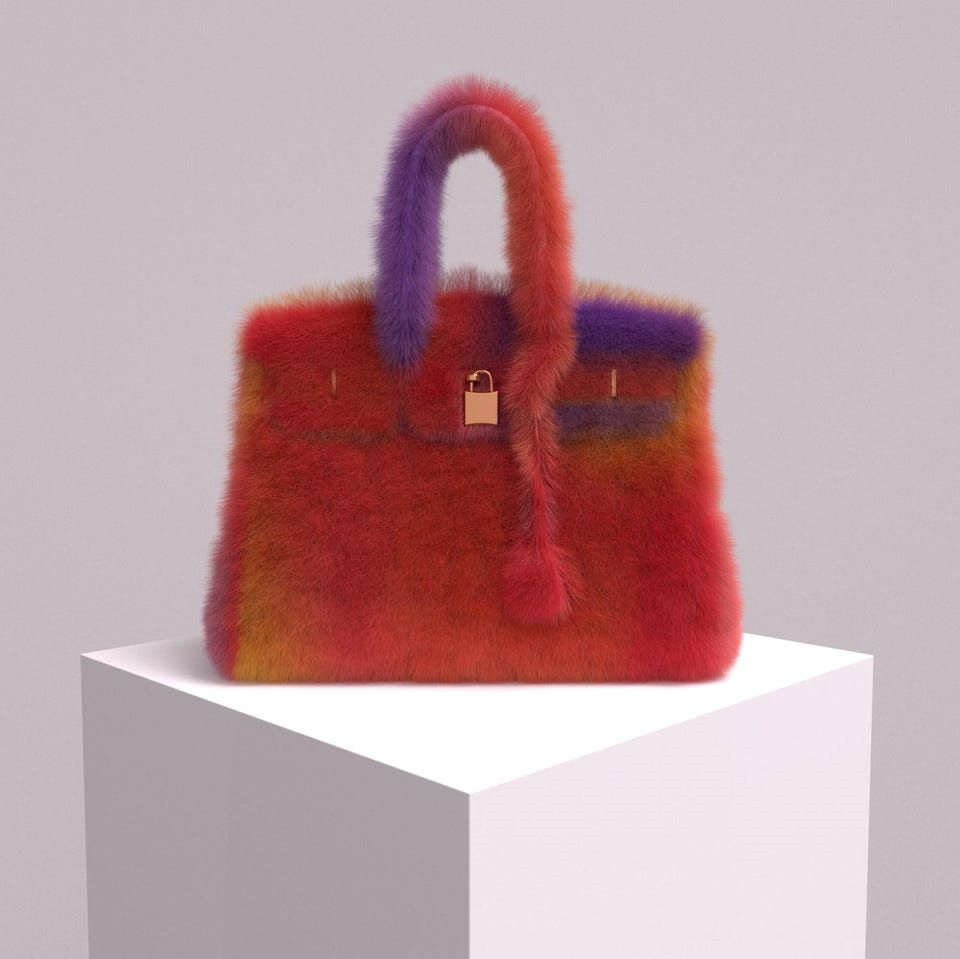
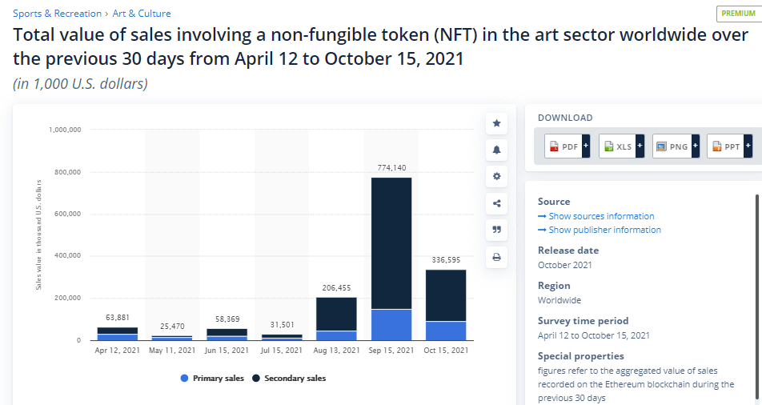
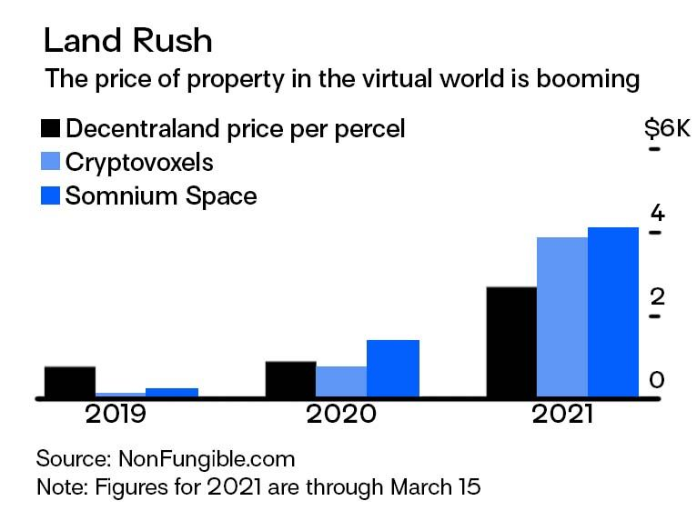
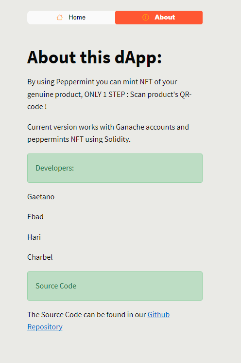
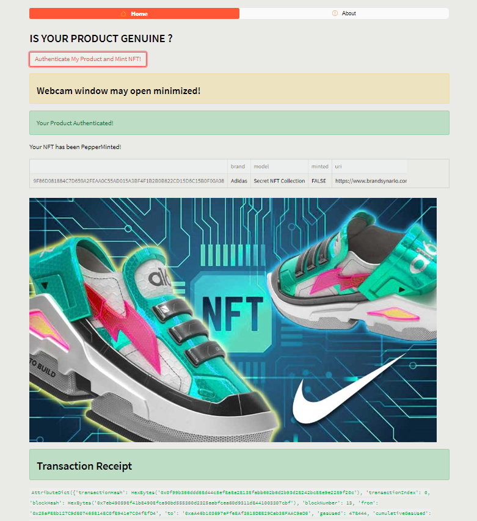

  

## Table of Contents

- [Table of Contents](#table-of-contents)
  - [Manufacturing and Distribution of Counterfeit Goods](#manufacturing-and-distribution-of-counterfeit-goods)
  - [Fraud and Crypto](#fraud-and-crypto)
  - [Blockchain as a Solution](#blockchain-as-a-solution)
  - [What is a Non Fungible Token (NFT)?](#what-is-a-non-fungible-token-(NFT)-?)
  - [Market Outlook](#market-outlook)
  - [Adoption of the Metaverse by Major Brands](#adoption-of-the-metaverse-by-major-brands)
  - [Introducting pepperMint()](#introducing-pepperMint())
  - [Technology Stack](#technology-stack)
  - [User Experience](#user-experience)
  - [Unanticipated-problems-and-insights](#unanticipated-problems-and-insights)
  - [Future Developments for Consideration](#future-developments-for-consideration)
  - [References](#references)
    
## Manufacturing and Distribution of Counterfeit Goods

> Counterfeit products are goods of inferior quality that are manufactured and distributed under another brand's name without the brand owner's authorization. Sellers of counterfeit products profit by infringing on the trademark, patent or copyright of the brand owner by passing off it's goods as made by the brand owner. 

In 2018, Forbes reported that counterfeiting was the largest criminal enterprise in the world. Sales of counterfeit and pirated goods totals $1.7 trillion per year, which is more than drugs and human trafficking. It is expected to grow to $2.8 trillion and cost 5.4 million jobs by 2022. 

According to The Counterfeit Report, "China produces 80% of the world's counterfeits and we're supporting China. Whether or not it's their intention to completely undermine and destroy the U.S. economy, we [in the United States] buy about 60% to 80% of the products." It states:

Companies spend millions or billions of dollars building brands, and building reputations and they're being completely destroyed by counterfeits. And when you take that across a universe of goods, Americans' confidence in their own products is nonexistent. Retailers, the malls, the retail stores are closing up, and we're becoming a duopoly of Walmart and Amazon.

In addition to the economic growth of legitimate business, the production and trafficking of counterfeit products poses a significant health and safety threat to consumers. 

“Counterfeit products not only attack the name and value of a known business, but, in many cases, can cause harmful, and sometimes fatal, consequences for the unsuspecting buyer,” said Mark Zito, Deputy Special Agent in Charge for HSI Los Angeles.

Some of the most dangerous counterfeit products involve automotive parts, electronics, safety equipment, cosmetics and prescription drugs due to the threats they represent to public health and safety.  Examples include: 

* Counterfeit airbags and their components can cause severe malfunctions ranging from non-deployment, under inflation, over inflation to explosion of metal shrapnel during deployment in a crash.

* Counterfeit lithium-ion laptop batteries pose significant risk of extreme heat, self-igniting, and exploding.

* Counterfeit helmets and baby carriers can break.

* Counterfeit prescription drugs may not contain the active ingredient or could lead to accidental overdose.

* Counterfeit cosmetics can cause severe skin reactions.

Fake products are everywhere. Fronm cosmetics to cooking oil and clothing, every industry suffers heavily due to counterfeit products. 

## Fraud and Crypto

Counterfeiters gain traction from supply chain disruptions and production shortages. The pandemic has had a negative effect on the global supply chain, providing counterfeiters with an opportunity to flood the market with fake products to meet the demand. The size of the counterfeit products market reflects the failure of authentic countermeasures, and businesses have realized this too. 

Some businessnes ignore the creation of fake products under their branding, as the cost of fighting the counterfeiters can be prohibitive for many small to medium sized businessness. More often than not, litigation costs for SME's outweigh the losses and limit the businessnes ability to enforce their intellectual property rights. 

## Blockchain as a Solution 

> Blockchain can address the worlds counterfeiting problem by identifying a products proof of origin which can assist quality checks at every level, between the manufacturers production to consumer delivery.

Smart tags are integral to a blockchain solution to eliminate the prevalence of counterfeiting. Some of the most commonly used smart tags include:
 

* RFID tags: Radio frequency identification tags use radio waves for communication. A reader is required to receive signals from an RFID tag.

* QR codes: They are widely used by businesses for purposes such as payments and shipment tracking. Unlike RFID tags, QR codes can be read by any smartphone or tablet, making it convenient for businesses to view shipment status. 

* NFC chips: NFC stands for near-field communication chip, a silicon component that can be attached to an antenna to enable short-range wireless communication between two devices. Combining a uniquely programmed NFC chip with blockchain leads to increased transparency and trust in the supply chain.

This repository demonstrates the implementation of QR codes to reduce the annual cost of counterfeit production to the global economy, in addition to the health and safety threat of fraudulent products to consumers.

 

    <b><a href="#top">↥ back to top</a></b>

 

## What is an Non Fungible Token (NFT)?

> A non-fungible token (NFT) is a financial security consisting of digital data stored in a blockchain, a form of distributed ledger. Each token is unique and not interchangeable. The ownership of an NFT is recorded in the blockchain which allows the token to be sold and traded by the owner. 

NFTs are minted (issued) on a decentralized distributed-ledger technology (DLT) network that is neither controlled nor dependent on one single centralized instance. 

An NFT is controlled only by the person holding the private keys to the address to which an NFT is assigned in the smart contract ledger and are freely transferable within and outside various metaverses and marketplaces.

According to Wikipedia, the ownership of an NFT (as defined by the blockchain) has no inherent legal meaning, and does not necessarily grant copyright, intellectual property rights, or other legal rights over its associated digital file. An NFT does not restrict the sharing or copying of its associated digital file, and does not prevent the creation of NFTs that reference identical files.

The Wikipedia entry is viewed as inaccurate by the writer. In the matter of Hermès International, et al. v. Mason Rothschild, 1:22-cv-00384 [SDNY], designer brand Hermes has commenced legal proceedings in connection with the ‘MetaBirkins’ NFT collection. The NFT collection includes images of furry renderings of the Hermes Birkin handbag, and the first was sold via Open Sea in December 2021 for $42,000.00 USD. 

 
Hermès is relying on its existing trademark rights to the BIRKIN word trademark and the BIRKIN bag’s trade dress as the basis for its claims of trademark infringement, false designation of origin, trademark dilution, cybersquatting, and injury to business reputation and dilution. The Hermes case highlights key points for consideration in connection with trademark rights and the use of such trademarks as NFTs or within the metaverse, some of which include: 

* Selling physical and virtual products via metaverse to a consumer in a jurisdiction where the manufacturer does not have trademark protection could lead to infringement proceedings if prior similar third party rights exist in that country. This risk factor affects smaller less established brands, as well known brands (for example - Nike, Adidas etc) can rely on their established reputation; and 

* Trademarks are protected for those classes of goods and services for which they have been registered. Retailers operating within the metaverse must consider whether the virtual copy of their product could be covered by the same class, or if this would require additional registration in other goods and services classes. 

 

    <b><a href="#top">↥ back to top</a></b>

 

### Market Outlook

The NFT market grew dramatically from 2020–2021: the trading of NFTs in 2021 increased to more than $17 billion, up by 21,000% over 2020's total of $82 million. 

 

The lookout for 2022 is positive. Cointelegraph reports that more than 80% of consumers believe that a brand’s digital presence is as important as its physical presence, helping drive demand for branded NFT assets.

    <b><a href="#top">↥ back to top</a></b>

### Adoption of the Metaverse by Major Brands

 

In July 2021, Coke teamed up Tafi (3D digital design studio) for its inaugural NFT campaign. The NFT campaign centered around “loot boxes,” that were virtual goodie bags containing a variety of digital assets, including a branded puffer jacket wearable NFT, a sound visualizer NFT, and a friendship card NFT. Combining utility with nostalgia, Coca-Cola’s debut NFT drop is an iconic case study for brands entering the metaverse.

 

Nikeland was one of the first major efforts from a top-tier brand to blend sales, marketing, and gaming. It also provided a virtual showroom where visitors could flaunt their avatars’ new virtual Nike gear. Nikeland has helped to prove the huge commercial value of the metaverse while simultaneously proving that a huge number of fans are genuinely keen on branded experiences in virtual environments.

 

In 2021, the global fashion brand launched “Gucci Garden Archetypes,” a two-week virtual experience “that explores and celebrates the house’s inimitable creative vision,” Gucci said in a statement at the time. The brand has also launched “Gucci Town,” which has been designed to be a virtual rendering of its concept store, as well as a space for visitors to socialise. These virtual experiences represent Gucci’s commitment to doing everything that it can to remain ahead of other global brands in a highly competitive market.

 

Adidas made Web3 history when it launched “Into the Metaverse,” a NFT drop created in partnership with NFT companies Gmoney, Punks Comic, and Bored Ape Yacht Club in late 2021. The company has been able to effectively leverage the NFT marketplace and the metaverse to promote the ethos of individuality and self-expression that the brand has long pushed for in its traditional marketing. “We've embarked on the new age of originality, we said from the very beginning that if we're going to be the brand that’s going to stand for, represent and help push the values of this new generation into the world, then we must move at the speed of culture,” Erika Wykes-Sneyd, Adidas’ vice president of brand communications, said in a statement from December 2021, around the launch of “Into the Metaverse.” “This goes back to the principles of Adidas, where we embrace the edge, open the door for the new and act with rebellious optimism.”

 

    <b><a href="#top">↥ back to top</a></b>

 

## Public Sentiment 

 

# pepperMint()

pepperMint() is an implementation of NFT technology in the real world, as opposed to the metaverse, whereby counterfeit products are known to cause significant harm to businesses and consumers globally. Our blockchain solution is a representation for an entirely tokenised economy, where smart contracts trade assets and commodities, and consumers can see the history of goods they purchase via immutable blockchain records. 
  
The express purpose of our smart contract is to reduce and eliminate counterfeit production, and to act as the conduit for intellectual property rights validation and enforcement for small sized business' and multinational corporations. 

### Features & Benefits 

* Counterfeit and fraud prevention.

* Consumers may verify the authenticity of their products and the legitimacy of their ownership. 

* NFTs can be used to verify the authenticity of physical goods by storing all relevant information relating to a product in an NFT on a decentralized network.  The successful use of the technology is based on how the product to be protected can be connected to the DLT. pepperMint() achieves product protection with the use of QR codes in the NFT minting process. 

* QR code 'smart tag' implementation.

* NFT and product owners have the ability to transfer ownership. 

* Eliminate the re-sale of stolen goods with a sustained reduction of the criminalised offence over time.

* Existing solutions offering pre minted NFT's attract transfer fees that in most cases exceeds the minting fee. 

* By contrast, PepperMint provides consumers with the ability to mint NFT's as part of the unboxing process.

* The unboxing experience will result in user generated marketing content by the consumer. User-generated content is an effective marketing strategy. 

* pepperMint() isn't reserved for global brands. Minting services available to business' of all sizes.

### Breitling's implementation of a blockchain solution benefiting their customers

Since 13 October 2020, all new Breitling watches are delivered with a blockchain based digital passport to guarantee the products authenticity. Consumers are afforded the benefit of blockchain technology, digital security and proof of ownership. 

https://user-images.githubusercontent.com/95597283/172084515-513613e4-a450-48a7-b983-b4f5f92d7241.mp4

### Technology Stack

The current version of peppermint() relies on the following technologies to achieve the demonstrated functionality:
* Solidity: an object oriented programing langugage for implementing smart contracts on the Ethereum blockchain. 

* Python: a high level, interpreted, general-purpose programming language. 

* Ganache: a personal ethereum blockchain use to run tests, execute commands and inspect state while controlling how the chain operates. 

* Metmask: cryptocurrency wallet used to interact with the Ethereum blockchain and decentralized applications. 

* Streamlit: an open source app framework in the Python language used to create interactions with smart contracts and data science/ML models.

* QRcode: Python based QR code generator.

 

    <b><a href="#top">↥ back to top</a></b>

 

### User Experience

 

 

 

    <b><a href="#top">↥ back to top</a></b>

 

### Unancticipated Problems and Insights 

The peppermint() smart contract accepts the name and symbol of a tokenised asset and invokes a peppermint instance. When there are multiple instances of the same contract, the cost of the resulting transactions (gas) will increase by a multiple equivalent to the number of instances generated in the pepperMint() smart contract. 

An upgradable smart contract will contribute to a significant reduction in transaction costs. 

Ethereum contracts are ummutable. Once they are deployed to the blockchain they cannot be updated, however the need to alter their logic with time is necessary. During a contract upgrade, the following factors need to be considered - 
* Block gas limit, and 
* Inter-contract dependencies. 

The underlying principles for upgrading an immutable contract can be found in the Ethereum white paper 'DAO' seciton (https://github.com/ethereum/wiki/wiki/White-Paper#decentralized-autonomous-organizations) which states - 

> Although code is theoretically immutable, one can easily get around this and have de-facto mutability by having chunks of the code in separate contracts, and having the address of which contracts to call stored in the modifiable storage.

The following must be considered when deploying an upgradable smart contract: 
* Implementation of permanent storage. 
* Encapsulating logic in a library of functions. 
* Abstracting via an interface. 

Implementing permanent storage, encapsulating logic in library functions and abstracting via an interface are all in line with this principle where we use address pointers in the calling Organisation contract for interacting with storage and business logic. 

 

    <b><a href="#top">↥ back to top</a></b>

 

### Future Developments for Consideration

* RFID and NFC 'smart tag' integration. 

* Off chain validation using Chainlink Oracles. 

* Metaverse implementation.

* Customer service functionality.

* Social media integration. 

* Manufacturer user interface. 

* Gated NFT website with access restricted to VIP token holders. 

* NFT gallery.

 

    <b><a href="#top">↥ back to top</a></b>

 

### References 
Counterfeit Goods, a Danger to Public Safety
https://www.ice.gov/features/dangers-counterfeit-items

Lollipuff Undercover: Fake Designer Bags in Asia
https://www.lollipuff.com/lollipuff-undercover-fake-designer-bags-in-asia/

5 Brands Winning in the Metaverse
https://www.thedrum.com/news/2022/06/01/5-brands-winning-the-metaverse

Breitling Becomes the First Luxury Watchmaker to Offer a Digital Passport Based on Blockchain for all of its New Watches
https://www.breitling.com/us-es/news/details/breitling-becomes-the-first-luxury-watchmaker-to-offer-a-digital-passport-based-on-blockchain-for-all-of-its-new-watches-33479  

How to Blockchain, Smart Tags are Tackling Counterfeit Goods
https://www.supplychainbrain.com/blogs/1-think-tank/post/34693-tackling-product-counterfeiting-with-blockchain#:~:text=Blockchain%20helps%20tackle%20counterfeiting%20by,level%2C%20from%20production%20to%20delivery

Non Fungible Tokens (Wikipedia article)
https://en.wikipedia.org/wiki/Non-fungible_token

Defiance ETFs, NFT Outlook for 2022
https://www.defianceetfs.com/nft-outlook-for-2022/

 

    <b><a href="#top">↥ back to top</a></b>

 
